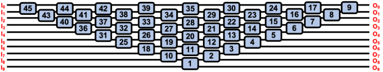
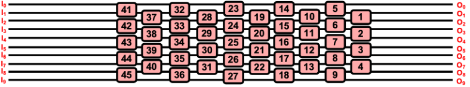
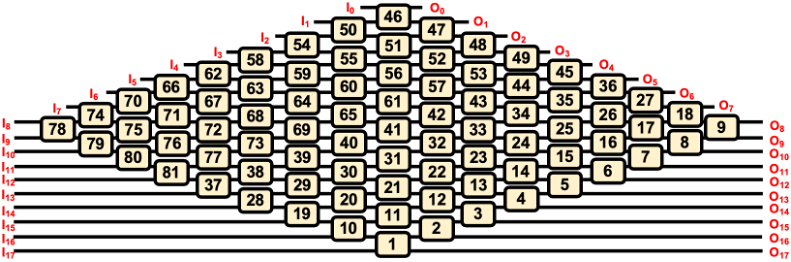
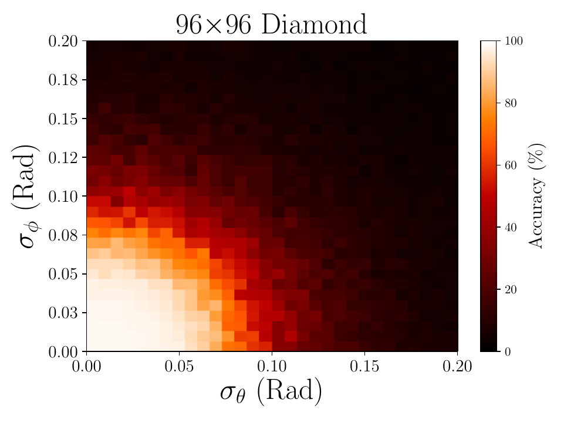
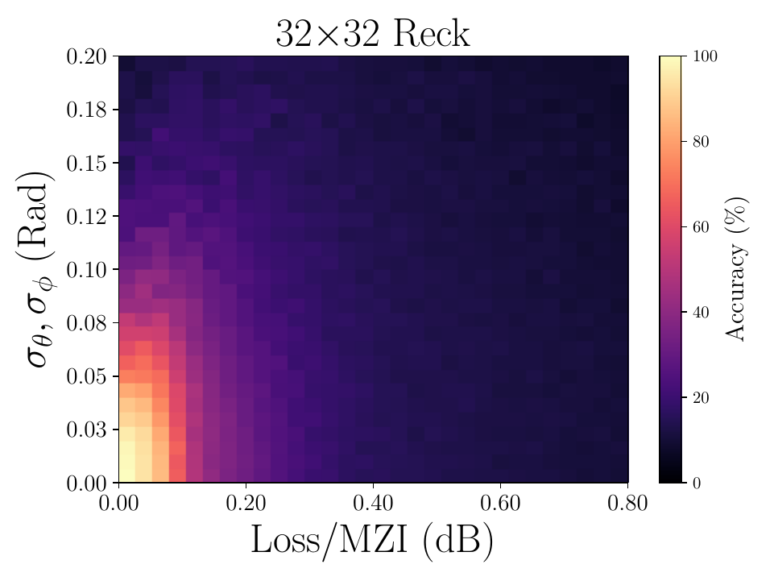

# Neuroptica: Towards a Practical Implementation of Photonic Neural Networks [](https://neuroptica.readthedocs.io/en/latest/?badge=latest) [](https://travis-ci.com/fancompute/neuroptica)

`Neuroptica` is a flexible chip-level simulation platform for [nanophotonic neural networks](https://arxiv.org/abs/1903.04579) written in Python/NumPy. It provides a wide range of abstracton levels for simulating optical NN's: the lowest-level functionality allows you to manipulate the arrangement and properties of individual phase shifters on a simulated chip, and the highest-level features provide a Keras-like API for designing optical NN by stacking network layers.

`Neuroptica: Towards a Practical Implementation of Photonic Neural Networks` was used to create and study Optical Neural Networks for [The diamond mesh, a phase-error- and loss-tolerant field-programmable MZI-based optical processor for optical neural networks](https://www.osapublishing.org/oe/abstract.cfm?uri=oe-28-16-23495) and many conference papers. The code itself was cloned from the original `Neuroptica` repository and subsequently modified in order to create the different meshes and figures seen in the papers. 

## Example Netowork meshes:

10x10 Reck:



10x10 Clements:



10x10 Diamond:




You can clone this modified Neuroptica repository:
```
git clone https://gitlab.com/simongg/neuroptica.git
```
 
and in your program or notebook, add

```python
import sys
sys.path.append('path/to/neuroptica')
``` 

`neuroptica` requires Python >=3.6.

## Quick Start
1. Locate [Main.py](https://github.com/Xoreus/neuroptica/blob/main/Simulations/main.py), in the main() method:

    1.1 Configure simulation settings in [init_onn_setting()](https://github.com/Xoreus/neuroptica/blob/f54c9b04ffd7911b489d2778e1443e56685636dd/Simulations/main.py#L60).
    
    1.2 Choose from the available dataset. (Gaussian, Mnist, Iris...etc.)
    
    1.3 Choose normalization method.
    
    1.4 Contruct model in [create_model()](https://github.com/Xoreus/neuroptica/blob/f54c9b04ffd7911b489d2778e1443e56685636dd/Simulations/main.py#L196), if switching between Diamond and Bokun mesh, see Bokun mesh section below.
    
    1.5 [Choose](https://github.com/Xoreus/neuroptica/blob/f54c9b04ffd7911b489d2778e1443e56685636dd/Simulations/main.py#L334) the loss function based on dataset and task.
    
    1.6 Run ```python main.py``` in console.

## Getting started

For an overview of `neuroptica`, read the [documentation](https://neuroptica.readthedocs.io). Example notebooks of the original code are included in the [`neuroptica-notebooks`](https://github.com/fancompute/neuroptica-notebooks) repository:

- [Planar data classification using electro-optic activation functions](https://github.com/fancompute/neuroptica-notebooks/blob/master/neuroptica_demo.ipynb)

Additionally, here are the main code files within the Simulations folder that one may want to go through when getting started:

- [linsep_main.py](https://gitlab.com/simongg/neuroptica/-/blob/master/Simulations/linsep_main.py) gives a good overview of how to program using this new `Neuroptica` repository. This code creates an ONN, then finds a linearly separable multivariate Gaussian dataset before training the ONN on this dataset.

- Finally, [main.py](https://gitlab.com/simongg/neuroptica/-/blob/master/Simulations/main.py) is where most of the work is done, and is the best file to learn how neuroptica works.

This updated repository contains a few additions, namely an ONN simulation class which takes in all simulation data, saves the training data and best phases, and plots various simulations. See below what this ONN simulation class can output.
- Some examples of what this Neuroptica package can do:




Here is a list of the more useful code within the Simulation folder:

[ONN_Simulation_Class.py](https://gitlab.com/simongg/neuroptica/-/blob/master/tests/ONN_Simulation_Class.py) -- contains the ONN simulation class, which holds various variables related to the training and simulating of a single ONN mesh.

[linsep_main.py](https://gitlab.com/simongg/neuroptica/-/blob/master/tests/linsep_main.py) -- code to automatically generate linearly separable, multivariate Gaussian datasets of arbitrary sizes (which achieves 100% classification accuracy with a digital neural network) and trains an Optical Neural Network with said dataset. 

[test_trained_onns.py](https://gitlab.com/simongg/neuroptica/-/blob/master/tests/test_trained_onns.py) -- after the training period is completed, this function is run to test the ONNs by calculating their accuracy while varying some imperfections.

[calculate_accuracy.py](https://gitlab.com/simongg/neuroptica/-/blob/master/tests/calculate_accuracy.py) -- code to calculate accuracy of an ONN while varying the insertion loss and/or the phase uncertainties phi and theta.

[ONN_Setups.py](https://gitlab.com/simongg/neuroptica/-/blob/master/tests/ONN_Setups.py) -- function that creates different meshes based on simple string of letters: R_R_P is Reck - Reck - Photodetector, for example.

[create_datasets.py](https://gitlab.com/simongg/neuroptica/-/blob/master/tests/create_datasets.py) -- creates various datasets, such as the Multivariate Gaussian dataset, the Iris dataset or the MNIST dataset (with the use of PCA)

[change_acc_lims.py](https://gitlab.com/simongg/neuroptica/-/blob/master/tests/change_acc_lims.py) -- changes the colormap limits and recreates them, which is useful when trying out new mesh sizes.

## Support for Calibration-Dependent Phase Error and Bokun Mesh
Implemented by Bokun Zhao (bokun.zhao@mail.mcgill.ca), during Summer 2022 SURE.
### Calibration-Dependent Phase Error
For Reck, Clement, Diamond, assigning different phase uncertainties for each MZI is now supported, this is to simulate varying calibration accuracy for each MZI due to their different degrees of accessiblity.

(TODO: detail Instruction on usage)
### Bokun Mesh (https://arxiv.org/abs/2303.04151)
To <span style="color:#1ff839">use middle ports</span> instead of bottom ports (Diamond):
1. [Main.py](https://github.com/Xoreus/neuroptica/blob/main/Simulations/main.py): In method `create_model()`, Change model construction.
2. [Layers.py](https://github.com/Xoreus/neuroptica/blob/main/neuroptica/layers.py): class "`AddMaskDiamond`, select appropriate lines to use inside methods `forward_pass()` and `backward_pass()`

To go from Diamond mesh to Bokun mesh:
1. <span style="color:#1ff839">Use middle ports</span> of the Diamond.
2. [Layers.py](https://github.com/Xoreus/neuroptica/blob/main/neuroptica/layers.py): Uncomment the two lines that contains `[4:14]`
3. [Layers.py](https://github.com/Xoreus/neuroptica/blob/main/neuroptica/layers.py): Change the two  `layerCount = 0` lines to `layerCount = 4` in class `DiamondLayer`
## Authors
`Neuroptica: Towards a Practical Implementation of Photonic Neural Networks` was written by [Simon Geoffroy-Gagnon](https://s-g-gagnon.research.mcgill.ca/), with help from Farhad Shorkaneh.

The original `neuroptica` was written by [Ben Bartlett](https://github.com/bencbartlett), [Momchil Minkov](https://github.com/momchilmm), [Tyler Hughes](https://github.com/twhughes), and  [Ian Williamson](https://github.com/ianwilliamson).
